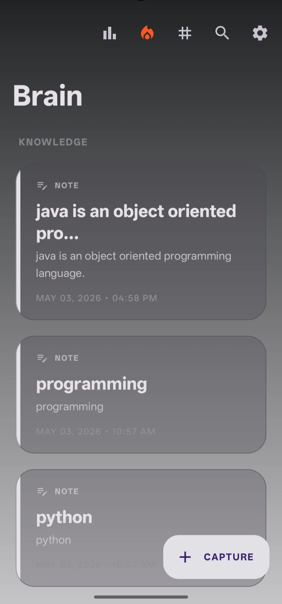
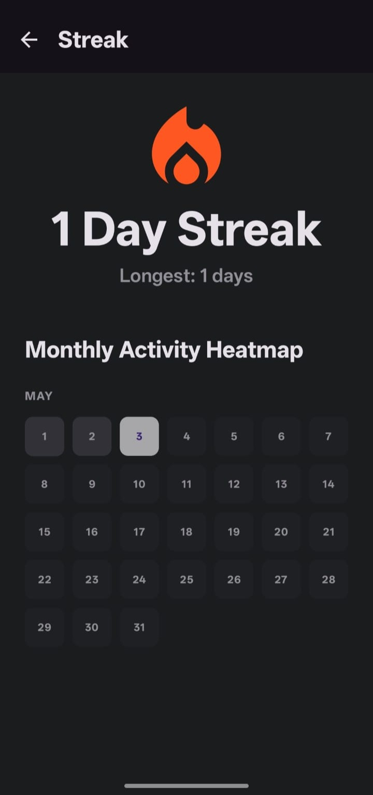
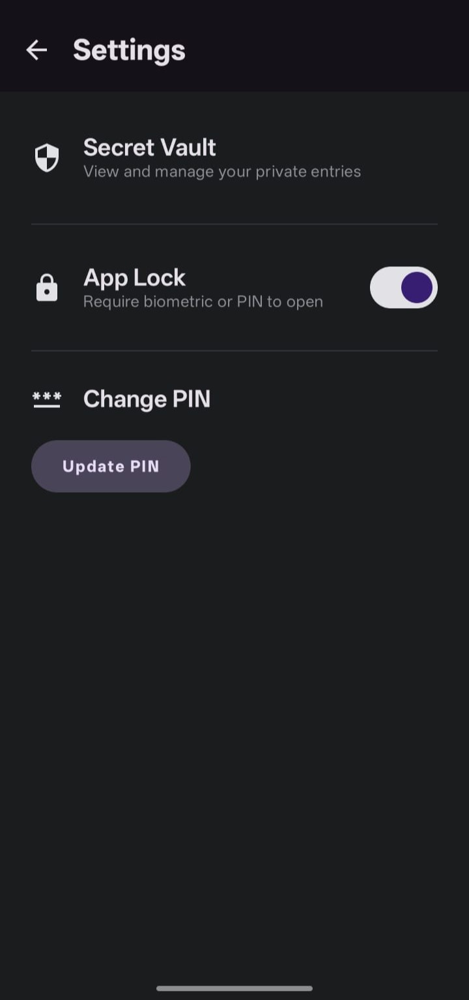
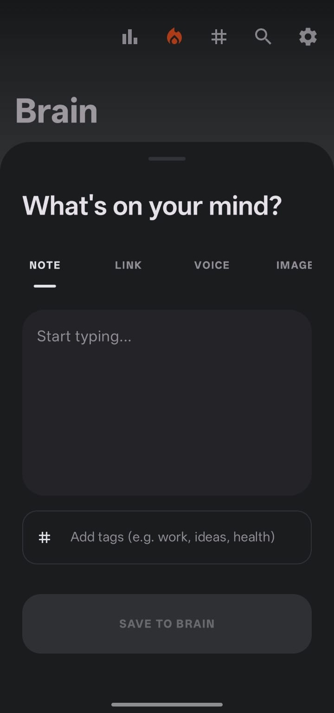

# SecondBrain 🧠

SecondBrain is a modern, high-performance Android application designed as a personal knowledge management system. Built with **Kotlin** and **Jetpack Compose**, it allows users to capture thoughts, links, images, and voice memos seamlessly while providing deep insights into their knowledge growth.

## 🚀 Features

### 🖋️ Seamless Capture
- **Multi-modal Entry**: Save text notes, bookmarks (links), images, and voice memos.
- **Global Capture**: Quick-access bottom sheet to record ideas instantly from any screen.
- **Link Metadata**: Automatically fetches titles, descriptions, and preview images from URLs using Jsoup.

### 🔒 Security & Privacy
- **Secure Onboarding**: First-time users are prompted to set a personalized 4-digit PIN.
- **Biometric Authentication**: Integrated Fingerprint/Face Unlock for quick and secure access.
- **The Vault**: A dedicated private space for sensitive information.
- **Auto-Lock**: Intelligent session management that locks the app after 2 minutes of inactivity.

### 📊 Insights & Analytics
- **Dynamic Heatmap**: Track your productivity with a month-accurate activity grid showing your daily contribution intensity.
- **Tag Cloud**: Visualize your knowledge themes. Frequently used tags appear larger, mapping out your mental focus.
- **Streak Tracking**: Stay consistent with built-in daily streak counters and "longest streak" records.

### 🔍 Search & Organization
- **FTS Search**: Blazing fast full-text search across all notes using Room FTS4.
- **Smart Tagging**: Organize entries with custom tags for easy filtering and discovery.
- **Pinned Entries**: Keep your most important thoughts at the top of your feed.

## 🛠️ Tech Stack

- **UI**: Jetpack Compose (Material 3)
- **Language**: Kotlin
- **Database**: Room (with FTS for search)
- **Dependency Injection**: Hilt
- **Async**: Coroutines & Flow
- **Navigation**: Compose Navigation
- **Networking**: Retrofit & OkHttp
- **Image Loading**: Coil
- **Lifecycle**: ProcessLifecycleOwner for security management
- **Preferences**: DataStore

## 📸 Screenshots

| Home Screen | Streak Heatmap | Settings Screen | Capture Screen | Tag Cloud |
| :---: | :---: | :---: | :---: | :---: |
|  |  |  |  |  |

## 🛠️ Installation

1. Clone the repository:
   ```bash
   git clone https://github.com/rkmaharana2004/SecondBrain.git
   ```
2. Open the project in **Android Studio (Ladybug or newer)**.
3. Sync Gradle and run the app on an emulator or physical device (Min SDK 28).

## 📄 License

This project is licensed under the MIT License - see the [LICENSE](LICENSE) file for details.

---
Created with ❤️ by [RK Maharana](https://github.com/rkmaharana2004)
